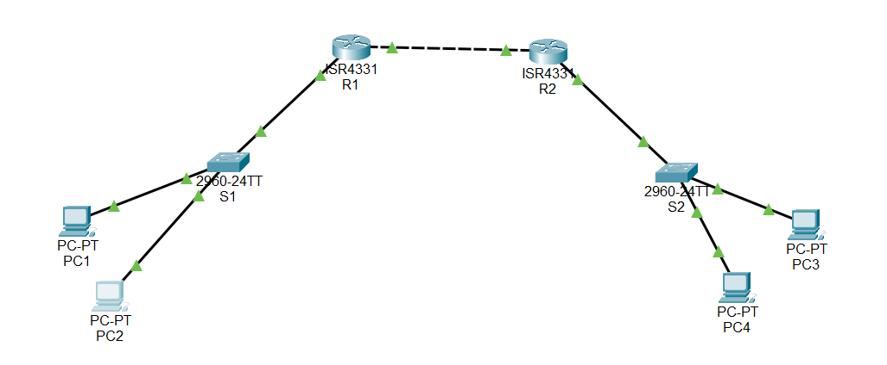

# Static Routing and Telnet Lab

## Overview

This lab demonstrates static routing between two Cisco routers and remote management using Telnet.

## Network Topology



## Devices Used

* 2 Cisco Routers
* 2 Switches
* Multiple PCs

## IP Addressing

| Network     | Subnet           |
| ----------- | ---------------- |
| LAN 1       | 172.16.15.0/26   |
| LAN 2       | 172.16.15.64/26  |
| Router Link | 172.16.15.192/30 |

## Static Routes

### R1

```bash
ip route 172.16.15.64 255.255.255.192 172.16.15.194
```

### R2

```bash
ip route 172.16.15.0 255.255.255.192 172.16.15.193
```

## Security Features

* Console password configuration
* Enable secret password
* VTY password configuration
* Telnet enabled on R2

## Verification Commands

```bash
show ip route
ping
show running-config
```

## Skills Demonstrated

* IPv4 Addressing
* Subnetting
* Static Routing
* Router Configuration
* Switch Configuration
* Network Security Basics
* Remote Access with Telnet

## Course Level

CCNA 1 / CCNA 2

